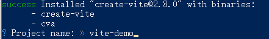
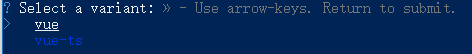
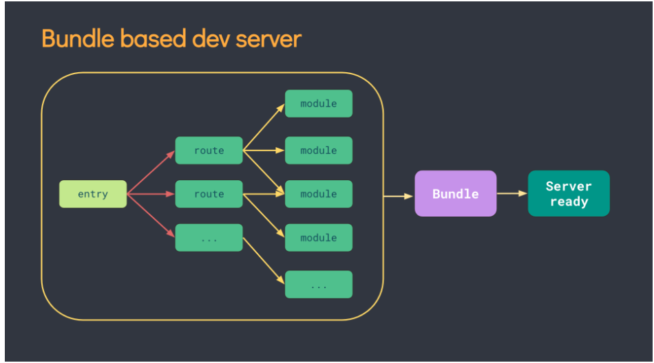

## 0.今日目标

1. 能够准确描述Vue3的新特性和设计理念； （ 面试 ）
2. 学会如何用vite创建vue3项目；
3. 掌握组合式API的使用 （ 重要 ）;
4. 完成Todo list项目部分功能

## 1 为什么要学习vue3

1. Vue 是目前国内开发最火的前端框架之一

   [react, vue, angular的下载趋势](https://gitee.com/link?target=https%3A%2F%2Fwww.npmtrends.com%2Fangular-vs-react-vs-vue)

2. Vue3性能更高，体积更小

3. 对TS的支持比较好

4. 社区生态已经逐步完善

5. 简单易用，方便构建大型项目

   | 组件（插件）名称 | 官方地址                                                     | 简介                                                         |
   | ---------------- | ------------------------------------------------------------ | ------------------------------------------------------------ |
   | ant-design-vue   | [https://antdv.com/docs/vue/introduce-cn/](https://gitee.com/link?target=https%3A%2F%2Fantdv.com%2Fdocs%2Fvue%2Fintroduce-cn%2F) | ant-design-vue 是 Ant Design 的 Vue 实现，组件的风格与 Ant Design 保持同步 |
   | element-plus     | https://element-plus.gitee.io/#/zh-CN                        | Element Plus，一套为开发者、设计师和产品经理准备的基于 Vue 3.0 的桌面端组件库 |
   | vant             | https://vant-contrib.gitee.io/vant/v3/#/zh-CN                | 有赞前端团队开源的移动端组件库，于 2016 年开源，已持续维护 4 年时间 |
   | Naive UI         | [https://www.naiveui.com/zh-CN/](https://gitee.com/link?target=https%3A%2F%2Fwww.naiveui.com%2Fzh-CN%2F) | 一个 Vue 3 组件库比较完整，主题可调，使用 TypeScript，不算太慢，有点意思 |
   | VueUse           | [https://vueuse.org/](https://gitee.com/link?target=https%3A%2F%2Fvueuse.org%2F) | 基于composition组合api的常用集合，小兔仙项目会部分使用       |

6. 积极拥抱新技术（不做弄潮儿，也不能太落后） 

### 小结

​	**广阔的市场、更高的性能、前沿的技术、良好的生态体系、更好的工程化**

## 2. Vue3的新特性

### 目标

1.掌握Vue3新特性

2.能够回答Vue3新特性相关面试题

### 路径

Vue3 设计理念  https://vue3js.cn/vue-composition/ 

动机与目的: 

1. 更好的逻辑复用 与  代码组织  (composition组合式api) 

   optionsAPI(旧) => compositionAPI（新）,   效果: 代码组织更方便了, 逻辑复用更方便了   非常利于维护!!

2. 更好的类型推导 (typescript支持)

   vue3 源码用 ts 重写了, vue3 对 ts aaa的支持更友好了  (ts  可以让代码更加稳定, 类型检测! )

vue3新特性：

1. 数据响应式原理重新实现  (ES6 proxy 替代了 ES5 的 Object.defineProperty) 

   解决了: 例如数组的更新检测等bug, 大大优化了响应式监听的性能 

   (原来检测对象属性的变化, 需要一个个对属性递归监听)  **proxy 可以直接对整个对象劫持**

2. 虚拟DOM - 新算法 (更快 更小)

3. **提供了composition api, 可以更好的逻辑复用**

4. 模板可以有多个根元素

5. 源码用 typescript 重写, 有更好的类型推导 (类型检测更为严格, 更稳定)

   ...

### 总结

**vue3 性能更高, 体积更小,  更利于复用, 代码维护更方便**

## 3. vite的创建vue3项目

### 目标

学会使用Vite创建一个Vue3项目

### 步骤

1）使用vite创建项目

```bash
npm create vite
# or
yarn create vite
```

（2）输入项目名字，默认为vite-project





（3）选择创建的项目类型，选择vue即可


（4）选择创建的vue项目类型，  不选ts



（5）启动项目


**vite快捷使用**

如果想要快速创建一个vue3项目，可以使用如下命令

+ 创建普通vue项目

```bash
yarn create vite vite-demo --template vue
```

+ 创建基于ts模板的项目

```bash
yarn create vite vite-demo-ts --template vue-ts
```


### 总结

1. 问题： 创建项目的命令是  ？

   A.  `npm create vite`   B.`yarn create vite`

## 4.为什么使用Vite

### 目标

明白vite的优势，了解vite的工作流程

### 作用

Vite（法语意为 "快速的"，发音 `/vit/`，发音同 "veet")是一种新型前端构建工具

Vite 官方文档：https://cn.vitejs.dev/

### 优势

- 💡 极速的服务启动，使用原生 ESM 文件，无需打包
- ⚡️ 轻量快速的热重载，始终极快的模块热重载（HMR）
- 🛠️丰富的功能，对 TypeScript、JSX、CSS 等支持开箱即用
- 📦等等

**传统方式**

- 基于打包器的方式启动，必须优先抓取并构建你的整个应用，然后才能提供服务。

- 更新速度会随着应用体积增长而直线下降。

  
  
  
  
  

**vite 方式**

- Vite 以 [原生 ESM](https://gitee.com/link?target=https%3A%2F%2Fdeveloper.mozilla.org%2Fzh-CN%2Fdocs%2FWeb%2FJavaScript%2FGuide%2FModules) 方式提供源码。这实际上是让浏览器接管了打包程序的部分工作。
- Vite 只需要在浏览器请求源码时进行转换并 **按需提供源码**。

根据情景动态导入代码，即只在当前屏幕上实际使用时才会被处理。


### 总结

vite以ESM的方式提供源码，按需加载。

问题

- Vite 是否需要先打包才能提供服务？
- 使用webpack能否创建vue3的项目？ 

##  5. Vue3项目介绍

### 目标

掌握vue3项目结构

###  路径

+ 删除src下所有的文件和代码

+ 创建App.vue

### 总结

```import { createApp } from 'vue'
import App from './App.vue'

createApp(App).mount('#app')
```

## 6. 插件说明

+ vue2中需要安装插件`vetur`，可以实现组件高亮。但是vue3的一些语法在vetur中报错。
+ vue3中需要安装插件`volor`，提供了更加强大的功能。
+ 所以，使用功能vue3，需要卸载/禁止`vetur`插件，安装`volar`插件。
+ 

## 7. composition API (组合式API) vs options API

### 目标

1. 掌握composition API vs options API的不同
2. 能够回答相对应的面试题。

### 区别

1. vue2 采用的就是 `optionsAPI`

   (1) 优点:**`易于学习和使用`**, 每个代码有着明确的位置 (例如: 数据放 data 中, 方法放 methods中)。

   (2) 缺点:  碎片化严重，相似的逻辑, 不容易复用, 在大项目中尤为明显

   (3) 虽然 optionsAPI 可以通过mixins 提取相同的逻辑, 但是也并不是特别好维护

2. vue3 新增的就是 `compositionAPI `

   (1) compositionAPI 是基于  **逻辑功能**  组织代码的, 一个功能 api 相关放到一起

   (2) 即使项目大了, 功能多了, 也能快速定位功能相关的 api

   (3) 大大的提升了 `代码可读性` 和 `可维护性`

3. vue3 推荐使用 composition API, 也保留了options API

   即就算不用composition API, 用 vue2 的写法也完全兼容!!

### 总结

1. **` optionsAPI`的优缺点是什么? **

2. **vue3 新增的 `compositionAPI ` 有什么特征?  有什么优势? **

## 8. Vue2 vs Vue3 案例演示

### 目标

体验Vue和Vue3的不同

### 需求

鼠标移动显示鼠标坐标 x, y


### 实现

Options api

```js
<template>
	<div>当前鼠标位置</div>
  <div>x: {{ mouse.x }}</div>
  <div>y: {{ mouse.y }}</div>
  <div>当前点击次数：{{ count }}</div>
  <button @click="add">点击</button>
</template>

<script>
export default {
  // vue2 中采用的是 options API
  // 常见的配置项: data created methods watch computed components
  data() {
    return {
      mouse: {
        x: 0,
        y: 0,
      },
      count: 0,
    }
  },
  mounted() {
    document.addEventListener('mousemove', this.move)
  },
  methods: {
    move(e) {
      this.mouse.x = e.pageX
      this.mouse.y = e.pageY
    },
    add() {
      this.count++
    },
  },
  destroyed() {
    document.removeEventListener('mousemove', this.move)
  },
}
</script>
```

组合式api

```js
<template>
<div>当前鼠标位置</div>
  <div>x: {{ mouse.x }}</div>
  <div>y: {{ mouse.y }}</div>
  <div>当前点击次数：{{ count }}</div>
  <button @click="add">点击</button>
</template>

<script>
import { onMounted, onUnmounted, reactive, ref } from 'vue'

export default {
  setup() {
    const count = ref(0)
    const add = () => {
      count.value++
    }

    const mouse = reactive({
      x: 0,
      y: 0,
    })

    const move = (e) => {
      mouse.x = e.pageX
      mouse.y = e.pageY
    }
    onMounted(() => {
      document.addEventListener('mousemove', move)
    })
    onUnmounted(() => {
      document.removeEventListener('mousemove', move)
    })
    return {
      count,
      add,
      mouse,
    }
  },
}
</script>
```

组合api中的抽离

```
function useMouse() {
  const mouse = reactive({
    x: 0,
    y: 0,
  })
  const move = (e) => {
    mouse.x = e.pageX
    mouse.y = e.pageY
  }
  onMounted(() => {
    document.addEventListener('mousemove', move)
  })
  onUnmounted(() => {
    document.removeEventListener('mousemove', move)
  })
  return mouse
}

function useCount() {
  const count = ref(0)
  const add = () => {
    count.value++
  }
  return {
    count,
    add,
  }
}
```

### 总结

optionsAPI:

- 优点:**`易于学习和使用`**, 每个代码有着明确的位置
- 缺点:  相似的逻辑, 不容易复用

compositionAPI:

- 基于  **逻辑功能**  组织代码
- 可维护性好!

## 9. 组合API-setup函数

### 目标

​	掌握setup函数的基本使用

### 作用

`setup` 是一个新的组件**选项**，作为组件中使用组合API的**起点**。

1. setup 函数是一个新的组件选项，作为组件中组合式API 的起点（入口）
2. **setup 中不能使用 this， this 指向 undefined**
3. setup函数在beforeCreate生命周期钩子执行之前执行
4. 在模版中需要使用的数据和函数，需要在 `setup` 返回。

### 演示代码

```vue
<template>
  <div class="container">
    姓名：{{name}}，月薪:{{salary}} <button @click="say">打个招呼</button>
  </div>
</template>
<script>
export default {
  setup () {
    console.log('setup执行了，这里没有this. this的值是：'， this)

    // 定义数据和函数
    const name = '小吴'
    const salary = 18000
    const say = () => {
      console.log('我是', name)
    }

    // 返回对象，给视图使用
    return { msg , say}
  },
  beforeCreate() {
    console.log('beforeCreate执行了， 这里有this，this的值是:',  this)
  }
}
</script>
```


### 小结

1. setup的执行时机？

​		A. 比beforeCreate后执行

​		B. 比beforeCreate先执行

2. setup内部可以通过this访问到组件吗?

   A.可以  B.不可以

3. setup的返回值格式是？ A. 数组 B. 对象

4. setup中定义的变量怎么交给template ?

## 10.setup中定义数据

#### 目标：

1. 明白数据响应式的概念
2. 明白是setup中直接定义的数据没有响应式特性

#### 路径：

 数据响应式： 数据变化会引起template中视图的改变 

在setup中返回的普通数据

``` js
<template>
  <div class="container">
    姓名：{{name}}，月薪:{{salary}} <button @click="say">打个招呼</button>
  </div>
</template>
<script>
export default {
  setup () {
    console.log('setup执行了')
    console.log(this)
    // 定义数据和函数
    const name = '小吴'
    const salary = 18000
    const say = () => {
      console.log('我是', name)
      salary *= 2
    }

    return { msg , say}
  }
}
</script>
```

#### 总结 ：

1. 数据改变能够使视图引起响应变化，这种数据就是响应式数据
2. 在setup中返回的普通数据不是响应式的；

## 11. 组合API-用ref函数定义响应式数据

### 目标

掌握使用ref函数定义响应式数据

### 作用

 对传入的数据（一般简单数据类型），包裹一层对象,  转换成响应式。

1. ref 函数接收一个的值, 返回一个ref 响应式对象,  有唯一的属性 value
2. 在 setup 函数中, 通过 ref 对象的 value 属性, 可以访问到值
3. 在模板中, ref 属性会自动解套, 不需要额外的 .value
4. ref函数也支持传入复杂类型，传入复杂类型，也会做响应式处理

### 步骤

1. 从vue框架中导入`ref`函数。`import { ref } from 'vue'`；
2. 在setup函数中调用`ref`函数并传入数据（简单类型或者复杂类型),  `const  响应式数据 =ref(初值)` ；
3. 把ref函数的结果添加到setup函数的返回对象中。

演示代码

```vue
<template>
  <p>姓名：{{name}}, 公司：{{company}}，月薪：{{salary}}</p>
  <button @click="double">月薪double</button>
</template>
<script>
import { ref } from 'vue'
export default {
  name: 'App',
  setup () {
    // 定义响应式对象
    const company = ref('DiDi')
    const name = ref('小王')
    const salary = ref(18000)
    
    const double = () => {
      // 在代码中修改(或者获取)值时，需要补上.value
      salary.value *= 2
    }
    return {  
      name, 
      company,
      salary,
      double
    }
  }
}
</script>
```

注意：`ref` 接收参数并将其包裹在一个带有 `value` property 的对象中返回，然后可以使用该 property 访问或更改响应式变量的值：

### 小结

ref函数，用来定义响应式数据

- 在代码中修改(或者获取)值的时，需要补上____属性？
- 在______中使用时，可以省略.value

## 12. 组合API-用ref函数来获取Dom实例对象

### 问题导入

如何获取子组件（DOM）的引用？

### 目标

掌握使用ref属性绑定DOM或组件

### 回顾vue2.0的写法

步骤1： 通过ref属性绑定该元素 

步骤2：通过this.$refs.box获取元素 

```vue

<template>
	<div ref="xxx">
  	内容
  </div>
</template>

```


### vue3中的写法步骤

步骤1：导入ref函数 `import { ref } from 'vue'`

步骤2：在setup中， 使用ref函数传入null创建 ref对象 => `const hRef = ref(null)` 并导出

步骤3：模板中通过定义ref属性设置为步骤1中创建的ref对象名称建立关联  `<h1 ref="hRef"></h1>`

步骤4：使用。`hRef.value`

### 代码

```vue
<template>
  <div class="container">
    <div ref="dom">我是box</div>
    <button @click="hClick"></button>
  </div>
</template>
<script>
import { onMounted, ref } from 'vue'
export default {
  name: 'App',
  setup () {
    // 1. 获取单个元素
    const dom = ref(null)
    
    const hClick(()=>{
       // 获取值
       console.log(dom.value)
    })
    
    return {dom, hClick}
  }
}
</script>
```

### 小结

先声明ref响应式数据，返回给模版使用，通过ref绑定数据

## 13. 组合API-用reactive函数定义响应式数据

### 目标

掌握使用reactive函数定义响应式数据

### 作用

将复杂数据定义成为响应式数据。reactive是一个函数，它可以定义一个复杂数据类型，成为响应式数据。

### 步骤

1. 导入：从vue框架中导入`reactive`函数
2. 调用：在setup函数中调用reactive函数并将对象数据传入
3. 导出：在setup函数中把reactive函数调用完毕之后的返回值以对象的形式返回出去
4. 使用：在模块中使用

### 演示代码

```vue
<template>
  <p>姓名：{{stu.name}}, 公司：{{stu.company}}，月薪：{{stu.salary}}</p>
  <button @click="double">月薪double</button>
</template>

<script>
import { reactive } from 'vue'
export default {
  name: 'App',
  setup () {
    const stu = reactive({
      company: 'DiDi',
      name: '小王'，
      salary：18000
    })

    const double = () => {
      stu.salary *= 2
      console.log('stu.salary', stu.salary)
    }
    return {  
      stu,
      double
    }
  }
}
</script>
```

### 总结

reactive用来定义响应式数据,它用于复杂数据类型

##  14. 组合API-用toRefs函数简化响应式数据的使用

### 目标

掌握使用toRefs函数的用法

### 作用

定义将响应式中**所有**属性转为响应式数据，通常用于解构|展开reactive定义对象， 简化我们在模板中的使用。

**注意: 如果对一个响应数据, 进行解构 或者 展开, 会丢失他的响应式特性!**  

### 格式

```js
// 响应式数据：{ 属性1, 属性2 }
let { 属性1, 属性2 } = toRefs(响应式数据)
```

增强版的结构赋值：在解构对象的同时，保留响应式的特点。

### 代码

```vue
<template>
  <p>{{name}}, {{company}}</p>
  <button @click="jumpToJD">jumpToJD</button>
</template>
<script>
import { reactive, toRefs } from 'vue'
export default {
  name: 'App',
  setup () {
    // 定义响应式对象
    const stu = reactive({
      company: 'DiDi',
      name: '小王'
    })
    let { name, company } = toRefs(stu)

    const jumpToJD = () => {
      company.value = 'JD'
      name.value = '老王'
      console.log('toJD', company)
    }
    return {  name, company, jumpToJD }
  }
}
</script>
```

### 小结

toRefs与reactive配套使用。

```js 
const {p1, p2} = toRefs(reactive({p1, p2}))
```

在解构响应式数据时，还保持它的响应式特征。


## 15. 取舍ref和reactive

定义响应式数据有两种方式：

- ref函数(可以处理简单数据，也可以处理复杂数据)，常用于将简单数据类型定义为响应式数据
  - 在代码中修改(或者获取)值时，需要补上.value
  - 在模板中使用时，可以省略.value
- reactive函数，常用于将复杂数据类型为响应式数据

推荐用法：

1. 优先使用ref
2. 如果明确知道对象中有什么属性，就使用reactive。例如，表单数据

## 16. script setup语法(★)

### 目标： 

1. 学会script setup语法糖

### 作用

1. script setup是在单文件组件 (SFC) 中使用组合式 API 的编译时语法糖。相比于普通的 script 语法更加简洁

### 步骤

1. 要使用这个语法，需要将 `setup` attribute 添加到 `<script>` 代码块上

```js
<template>
  <div>
    <h3>根组件</h3>
    <div>点击次数：{{ count }}</div>
    <button @click="add">点击修改</button>
  </div>
</template>

<script setup>
import { ref } from 'vue'

const count = ref(0)
const add = () => {
  count.value++
}
</script>
```

### 总结

setup语法的使用   <script setup>

## 17. 组合API-用computed函数定义计算属性

### 目标

掌握使用computed函数定义计算属性

### 作用

官方：**计算属性**来描述依赖响应式状态的复杂逻辑

根据已有响应式数据生成新的响应式数据。

### 步骤

1. 从vue框架中导入`computed` 函数
2. 在setup函数中执行computed函数，并传入一个函数，在函数中定义计算规则，并返回结果
3. 把computed函数调用完的执行结果放到setup的return值对象中

### 格式

```js
import { computed } from 'vue'

const 计算属性名 = computed(() => {
  return 相关计算结果
})
```

### 示例


```jsx
<script setup>
import { ref, computed } from 'vue'

    // 定义响应式对象
    const company = ref('DiDi')
    const name = ref('小王')
    const salary = ref(18000)
    const double = () => {
			// 完成功能
    }
    // 完成功能
    const total = 0
    
</script>
<template>
  <p>姓名：{{name}}, 公司：{{company}}, 月薪：{{salary}}, 年薪{{total}}</p>
  <button @click="double">月薪double</button>
</template>

```

### 参考代码

```vue
<script setup>
import { ref, computed } from 'vue'

    // 定义响应式对象
    const company = ref('DiDi')
    const name = ref('小王')
    const salary = ref(18000)
    const double = () => {
			salary.value *= 2;
    }
    // 完成功能
    const total = computed(() => salary.value*12)
    
</script>
<template>
  <p>姓名：{{name}}, 公司：{{company}}, 月薪：{{salary}}, 年薪{{total}}</p>
  <button @click="double">月薪double</button>
</template>
```

### 小结

vue3中的computed函数与vue2中的computed选项功能类似。

computed的入参是一个函数

作用：根据已有数据，产生新的响应式数据。

步骤：导入，定义，导出

## 18. 组合API-computed的高级用法

### 目标

掌握计算属性的高级用法：设置set属性， 会用v-model来绑定计算属性

### 格式

```js
const 计算属性 =  computed({
  get () {
    // 当获取值自动调用
  },
  set (val) {
    // 当设置值自动调用，val会自动传入
  }
})
```

### 示例


### 基础代码

```jsx
<script setup>
import { ref, computed } from 'vue'

  
    const salary = ref(1000)
     
    const double = () => {
      salary.value *= 2
      console.log(salary)
    }
    // 定义计算属性: 普通的写法：只使用了get
    // const total = computed(() => {
    //   return stu.salary * 12
    // })

    // 定义计算属性: 高阶的写法：使用了get + set
    const total = computed(() => salary.value * 12)
</script>    

<template>
  <div style="padding:2em">
    <p>小花, 月薪:{{salary}}, 年薪:{{total}}</p>
    <p>年薪:<input /></p>
    <button @click="double">月薪double</button>
  </div>
</template>
```

### 参考代码

````vue
<script setup>
import { ref, computed } from 'vue'

  
    const salary = ref(1000)
     
    const double = () => {
      salary.value *= 2
      console.log(salary)
    }

    // 定义计算属性: 高阶的写法：使用了get + set
    // const total = computed(() => salary.value * 12)

    const total =computed({
        get(){
            return salary.value*12
        },
        set(value){
            salary.value = value/12;
        }
    })
</script>    

<template>
  <div style="padding:2em">
    <p>小花, 月薪:{{salary}}, 年薪:{{total}}</p>
    <p>年薪:<input  v-model="total"/></p>
    <button @click="double">月薪double</button>
  </div>
</template>
````

### 总结

计算属性两种用法

1. 给computed传入函数，返回值就是计算属性的值

2. 给computed传入对象，get获取计算属性的值，set监听计算属性改变

> 在v-model绑定计算属性： <input v-model="total" />

## 19. 组合API-watch函数

### 目标

掌握使用watch函数定义侦听器

### 作用

基于响应式数据的变化执行回调逻辑，和vue2中的watch的应用场景完全一致。

### 步骤

1. 导入。`import { watch } from 'vue'`

2. 开启监听。在setup函数中执行watch函数开启对响应式数据的监听

3. watch函数接收三个常规参数

   1. 第一个参数有三种取值：

      对象，要监听的响应式数据

      数组，每个元素是响应式数据

      函数，返回你要监听变化的响应式数据

   2. 第二个参数是：响应式数据变化之后要执行的回调函数

   3. 第三个参数是: 一个对象，在里面配置是否开启立刻执行或者深度监听

### 测试代码

```js
<script setup>
import { reactive, watch, ref } from 'vue'

        const salary = ref(10000)
        const stu  = reactive({
            address: {city: 'wuhan'}
        })

        // 1. 侦听-单个数据
        watch(salary, (newVal, oldVal) => {
            console.log('监听单个数据', newVal, oldVal)
        })
			 // 侦听-单个数据
        watch(stu, (newVal, oldVal) => {
            console.log('监听单个数据', newVal, oldVal)
        })

      	// 侦听-多个数据
        watch([stu, salary], (newVal, oldVal) => {
            console.log('监听多个数据', newVal, oldVal)
        })
				// 侦听对象的某个属性
        watch(()=>stu.address , (newVal, oldVal) => {
            console.log('第一个参数是函数', newVal, oldVal)
        }, {deep: true,  immediate: true} )

        // 测试按钮，修改数据
        const doSome = () => {
            salary.value +=1
            stu.address.city = '测试'
        }
</script>
<template>
    <div>
        {{stu}}, {{salary}}
        <button @click="doSome"> do</button>
    </div>
</template>

```


### 小结

作用：watch用来侦听数据的变化。

格式：watch(数据|数组|get函数，(新值，旧值)=>{回调处理逻辑}, {immediate:true|false, deep: true|false})


## 20. 组合API-父子通讯-父传子

### 目标 

能够实现组件通讯中的父传子

### 步骤

1. 父组件提供数据
2. 父组件将数据传递给子组件
3. 子组件通过defineProps进行接收
4. 子组件渲染父组件传递的数据

### 测试代码

父组件：app.vue

```vue
<script setup>
import { ref } from 'vue'
// 在setup语法中，组件导入之后就能够直接使用，不需要使用components进行局部注册
import Son from './components/Son.vue'

const money = ref(100)
const car = ref('玛莎拉蒂')
const changeMoney = (num) => {
  money.value = money.value - num
}
</script>


<Son :money="money" :car="car" @changeMoney="changeMoney"></Son>
```

子组件 son.vue

```vue
<script setup>
defineProps({
  money: Number,
  car: String,
})

const emit = defineEmits(['changeMoney'])

const change = () => {
  emit('changeMoney', 10)
}
</script>
```

注意：如果使用defineProps接收数据，这个数据只能在模板中渲染，如果想要在script中也操作props属性，应该接收返回值。

### 小结

1. defineProps的作用是什么？
2. 怎样在script中使用props? 

## 21. 组合API-父子通讯-子传父

## 目标

能够实现组件通讯中的子传父

##  步骤

1. 子组件通过defineEmit获取emit对象（因为没有this)
2. 子组件通过emit触发事件，并且传递数据
3. 父组件提供方法
4. 父组件通过自定义事件的方式给子组件注册事件

### 测试代码

子组件

```vue
<script setup>
defineProps({
  money: Number,
  car: String,
})

const emit = defineEmits(['changeMoney'])

const change = () => {
  emit('changeMoney', 10)
}
</script>
```

父组件

```vue
<script setup>
import { ref } from 'vue'
// 在setup语法中，组件导入之后就能够直接使用，不需要使用components进行局部注册
import Son from './components/Son.vue'

const money = ref(100)
const car = ref('玛莎拉蒂')
const changeMoney = (num) => {
  money.value = money.value - num
}
</script>


<Son :money="money" :car="car" @changeMoney="changeMoney"></Son>

```

### 总结

1. defineEmits的作用是什么？

## 21. 组合API-依赖注入-祖先传后代

### 目标

掌握使用provide函数和inject函数完成后代组件数据通讯

### 使用场景

最外层有祖先组件，里头有：子组件、孙组件、很多后代组件。这些后代组件共享祖先组件数据。


### 两个步骤

1. 祖先组件中提供数据： `provide('数据名1', 数据名)`
2. 后代组件中使用数据： `inject('数据名1')`

### 演示代码

父组件利用 provide 提供数据

```
<script setup>
import { provide, ref } from 'vue'
import Son from './components/Son.vue'
const money = ref(100)
provide('money', money)
</script>

<template>
  <div>
    <h1>我是父组件</h1>
    <div>金钱：{{ money }}</div>
    <hr />
    <Son></Son>
  </div>
</template>

<style lang="less" scoped></style>
```

子组件 (子孙后代, 都可以拿到这个数据)


```
<script setup>
import { inject } from 'vue'

const money = inject('money')
</script>

<template>
  <div>
    <h3>我是子组件--{{ money }}</h3>
    <button>修改数据</button>
  </div>
</template>

<style lang="less" scoped></style>


```


### 总结

- provide函数提供数据和函数给后代组件使用
- inject函数给当前组件注入provide提供的数据和函数

## 22. 组合API-依赖注入-后代改祖先

### 目标

掌握使用provide函数和inject函数完成后代组件数据通讯

### 两个步骤

1. 祖先组件中提供数据&**操作数据的函数f**： `provide('函数f', 数据名)`

2. 后代组件中获取**操作数据的函数f**，并调用数据： `inject('函数f')`

   父组件

   ``` 
   <script setup>
   import { provide, ref } from 'vue'
   import Son from './components/Son.vue'
   const money = ref(100)
   const changeMoney = (num) => {
     money.value = money.value - num
   }
   provide('money', money)
   provide('changeMoney', changeMoney)
   </script>
   ```

   子组件

    ``` 
    <script setup>
    import { inject } from 'vue'
    
    const money = inject('money')
    const changeMoney = inject('changeMoney')
    </script>
    ```

### 总结

1. 依赖注入的作用是什么？

2. 子孙组件中调用inject注入的方法，会触发持有该方法组件的处理函数。

## 23. vue3中废弃了过滤器

目标：明白Vue3中，过滤器已经被废弃，现在用函数代替了

演示代码：

格式化时间

```
<script setup>
import dayjs from 'dayjs'
const timeNow =Date.now();
const timeFormate = (time)=> {
  return dayjs(time).format('YYYY-MM-DD')
}

</script>

<template>
  {{timeFormate(timeNow)}}
</template>
```


## 24. 综合案例 - Todos

### 目标

 巩固vue3.0中组合式API的使用


### 需求分析

1. 动态显示待完成任务的列表；
2. 用户可以在输入框中输入一个新的待完成任务；
3. 输入框中输入完成后，待完成任务要增加到任务列表中；
4. 每条待完成任务都有一个删除按钮，用户可手动移除当前待完成任务；
5. 每条待完成任务都有一个状态标识，当用户完成任务时状态为✅，否则为空；
6. 底部有一个可以显示当前还有未完成任务项数；
7. 用户可以一次全选/取消。

### 列表展示功能

（1）在App.vue中提供数据

```js
<script setup>
import TodoHeader from './components/TodoHeader.vue'
import TodoMain from './components/TodoMain.vue'
import TodoFooter from './components/TodoFooter.vue'

// 提供数据
const list = ref([
  {
    id: 1,
    name: '吃饭',
    done: true,
  },
  {
    id: 2,
    name: '睡觉',
    done: false,
  },
  {
    id: 3,
    name: '打豆豆',
    done: false,
  },
])
</script>
```

(2)传递给Main组件

```js
<TodoMain :list="list"></TodoMain>
```

（3）子组件接收

```js
<script setup>
defineProps({
  list: {
    type: Array,
    default: () => [],
  },
})
</script>
```

（4）子组件渲染

```vue
<ul class="todo-list">
  <li :class="{ completed: item.done }" v-for="item in list" :key="item.id">
    <div class="view">
      <input class="toggle" type="checkbox" :checked="item.done" />
      <label>{{ item.name }}</label>
      <button class="destroy"></button>
    </div>
    <input class="edit" value="Create a TodoMVC template" />
  </li>
</ul>
```

### 修改任务状态功能

（1）子组件注册事件

```vue
<input
  class="toggle"
  type="checkbox"
  :checked="item.done"
  @change="changeFn(item.id)"
/>
```

(2)子传父

```js
<script setup>

const emit = defineEmits(['changeDone'])
const changeFn = (id) => {
  emit('changeDone', id)
}
</script>
```

(3)父组件

```js
const changeDone = (id) => {
  const todo = list.value.find((item) => item.id === id)
  todo.done = !todo.done
}

<TodoMain :list="list" @changeDone="changeDone"></TodoMain>
```

### 删除功能

（1）子组件

```vue
const emit = defineEmits(['changeDone', 'delTodo'])

<button class="destroy" @click="emit('delTodo', item.id)"></button>
```

(2)父组件

```vue
const delTodo = (id) => {
  list.value = list.value.filter((item) => item.id !== id)
}

<TodoMain
  :list="list"
  @changeDone="changeDone"
  @delTodo="delTodo"
></TodoMain>
```

### 添加功能

(1)子组件

```vue
<script setup>
import { ref } from 'vue'

const todoName = ref('')
const emit = defineEmits(['addTodo'])
const add = (e) => {
  if ( todoName.value) {
    emit('addTodo', todoName.value)
    todoName.value = ''
  }
}
</script>

<template>
  <header class="header">
    <h1>todos</h1>
    <input
      class="new-todo"
      placeholder="What needs to be done?"
      autofocus
      v-model="todoName"
      @keydown.enter="add"
    />
  </header>
</template>

<style lang="less" scoped></style>

```

(2)父组件

```js
const addTodo = (name) => {
  list.value.unshift({
    id: Date.now(),
    name,
    done: false,
  })
}


<TodoHeader @addTodo="addTodo"></TodoHeader>
```

### 底部功能 (计算属性)

(1)子组件

```js
<script setup>
import { computed } from 'vue'

const props = defineProps({
  list: {
    type: Array,
    default: () => [],
  },
})

const leftCount = computed(() => {
  return props.list.filter((item) => !item.done).length
})
</script>

<template>
  <footer class="footer">
    <span class="todo-count">
      <strong>{{ leftCount }}</strong> item left
    </span>
    <ul class="filters">
      <li>
        <a class="selected" href="#/">All</a>
      </li>
      <li>
        <a href="#/active">Active</a>
      </li>
      <li>
        <a href="#/completed">Completed</a>
      </li>
    </ul>
    <button class="clear-completed">Clear completed</button>
  </footer>
</template>

<style lang="less" scoped></style>

```

### 全选反选功能

(1)提供计算属性

```js
const isCheckAll = computed(() => {
  return props.list.every((item) => item.done)
})
```

(2)注册事件

```js
<input
  id="toggle-all"
  class="toggle-all"
  type="checkbox"
  :checked="isCheckAll"
  @change="emit('checkAll', !isCheckAll)"
/>
```

(3)父组件全选或者反选

```js
const checkAll = (value) => {
  list.value.forEach((item) => (item.done = value))
}

<TodoMain
  :list="list"
  @changeDone="changeDone"
  @delTodo="delTodo"
  @checkAll="checkAll"
></TodoMain>	
```

### watch 监视存到本地

```js
watch(
  list,
  (value) => {
    localStorage.setItem('todos', JSON.stringify(value))
  },
  {
    deep: true,
  }
)
```


## 24.作业

1. 练习组合式apis
2. 完成Todo list的剩余功能


